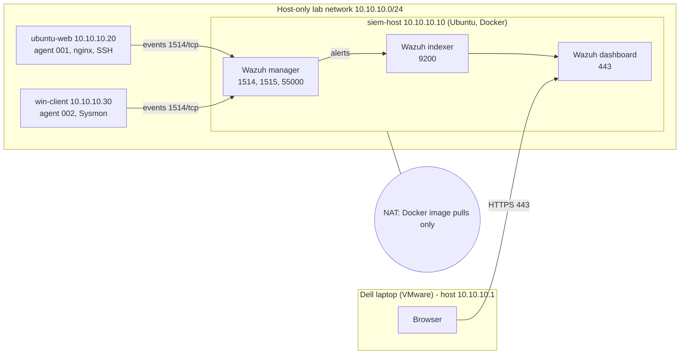

# Architecture diagram (Week 1)

```mermaid
flowchart LR
  subgraph Dell["Dell laptop (VMware) - host 10.10.10.1"]
    browser["Browser"]
  end
  subgraph LAB["Host-only lab network 10.10.10.0/24"]
    subgraph SIEM["siem-host 10.10.10.10 (Ubuntu, Docker)"]
      mgr["Wazuh manager<br/>1514, 1515, 55000"]
      idx["Wazuh indexer<br/>9200"]
      dash["Wazuh dashboard<br/>443"]
      mgr -->|alerts| idx --> dash
    end
    web["ubuntu-web 10.10.10.20<br/>agent 001, nginx, SSH"]
    win["win-client 10.10.10.30<br/>agent 002, Sysmon"]
  end
  nat(("NAT: Docker image pulls only"))
  web -->|events 1514/tcp| mgr
  win -->|events 1514/tcp| mgr
  browser -->|HTTPS 443| dash
  SIEM --- nat
```

TODO: replace or complement with your own drawing (draw.io / PNG) in this folder; the brief asks for your own diagram that matches what you built.
